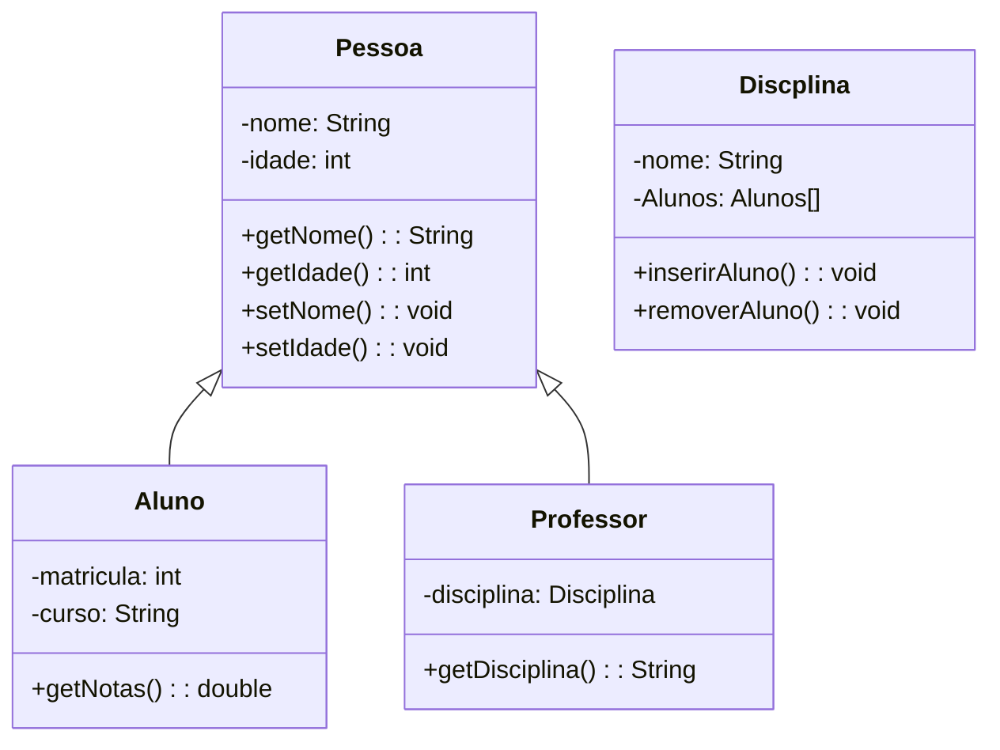

# Projeto Final da Disciplina de Programação Orientada a Objetos

## Sistema de Gerenciamento Escolar

```mermaid
classDiagram
    class Pessoa {
        -nome: String
        -idade: int
        +getNome(): String
        +getIdade(): int
        +setNome(): void
        +setIdade(): void
    }

    class Aluno {
        -matricula: int
        -curso: String
        +getNotas(): double
    }

    class Professor {
        -disciplina: Disciplina
        +getDisciplina(): String
    }

    class Discplina {
        -nome: String
        -Alunos: Alunos[]
        +inserirAluno(): void
        +removerAluno(): void
    }

    Pessoa <|-- Aluno
    Pessoa <|-- Professor
```
