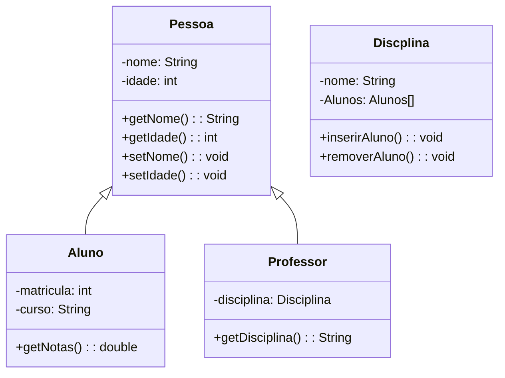

# Projeto Final da Disciplina de Programação Orientada a Objetos

## Sistema de Gerenciamento Escolar

>### Descrição
>O projeto visa criar um Sistema de Gerenciamento Escolar em Java com interface de texto, uma classe SistemaEscolar para simplificar a interação, classes Repositório para gerenciar entidades e regras de avaliação. Este sistema abrange a complexidade do ambiente acadêmico, considerando disciplinas semestrais (com duas notas).

### Funcionalidades
1. Cadastro de Alunos, Disciplinas e Professores:
    * Capacidade de cadastrar alunos, disciplinas e professores através da interface de texto.

2. Inserir e remover alunos de disciplinas

3. Atribuir e remover disciplinas de Professor
    * Cada disciplina só pode ter 1 professor 

4. Registro de Notas:
    * Professores devem registrar 2 notas e a nota da prova final, caso seja necessário.
    * Professores podem alterar as notas dos alunos

5. Regras de Avaliação:
    * Incorporação de regras de avaliação, onde alunos devem obter nota superior a 60 para aprovação; caso contrário, eles terão a oportunidade de fazer uma prova final.
    * Se a nota do aluno não atingir o mínimo necessário, o sistema permite a realização de uma prova final para tentar alcançar a aprovação.

6. Emissão de Boletins por Aluno
    * No boletim do aluno deve constar o seu nome completo e matrícula e a lista de disciplinas com as suas respectivas notas.

### Requisitos Técnicos
* Utilização de classes e objetos para modelar alunos, disciplinas, professores e notas.
* Crie um diagrama de classes do sistema.
* Criação de uma classe SisitemaEscolar para agrupar as ações do sistema.
* Interface de texto na linha de comando para interação com o usuário.
* Classes Repositório para agregar as classes de entidade (Alunos, Professores, …).
* Incorporação de regras de avaliação e prova final para a aprovação dos alunos.

